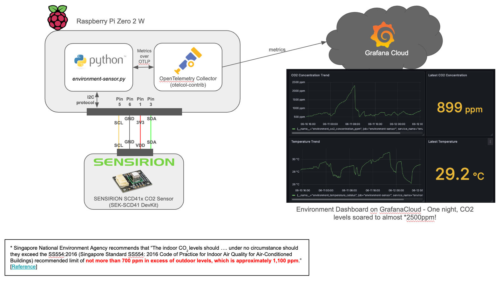
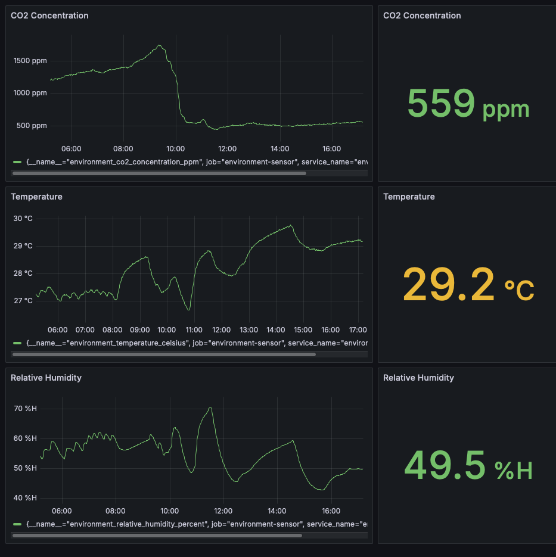

# Objective

The primary intention is to monitor for high CO2 concentration in a room, which is suspected to cause poor sleep quality and headaches.

At the same time, this is also intended as a personal development project to learn IoT data collection using the OpenTelemetry Collector and OpenTelemetry SDKs.

Grafana Cloud will be used as the observability platform, as the free tier provides ~2 weeks of data retention and visualization.

# Environment - Development & Operational

This project runs on/with the following:
- Sensirion SCD41 Industrial CO2, Temperature and Relative Humidity sensor
- Raspberry Pi 4B 8GB (development)
- Raspberry Pi Zero 2 W (operationally deployed)
- Ubuntu 24.04.2 LTS (aarch64)

# Architecture

The solution should look like this, when completed.


# Setting Up
## Set Up Sensor to Raspberry PI Connectivity

Not to repeat the work that is already done by the Sensirion team, refer to Sensirion's own repo at [Sensirion Raspberry Pi I²C SCD4X Driver - Connect the Sensor](https://github.com/Sensirion/raspberry-pi-i2c-scd4x/tree/master?tab=readme-ov-file#connect-the-sensor). This includes a wiring diagram.

## Set Up Collection Environment and Script

Download the latest code from this repository and cd into the directory.
```
~ $ git clone https://github.com/limweichiang/environment-sensor-otel.git
~ $ cd environment-sensor-otel
~/environment-sensor-otel $ 
```

Using a virtual environment is highly recommended. Create one and activate it.
```
~/environment-sensor-otel $ python3 -m venv .venv
~/environment-sensor-otel $ source .venv/bin/Activate
(.venv) ~/environment-sensor-otel $
```

Install the required dependencies.
```
(.venv) ~/environment-sensor-otel $ pip install -r requirements.txt
```

## Set Up Open Telemetry Collector

Install the OpenTelemetry Collector. I recommend referring to the [official installation guide](https://opentelemetry.io/docs/collector/installation/#linux). In this project, the **otelcol-contrib** collector is used instead, it's a variation that includes extensions that are required to transmit telemetry to Grafana Cloud. This is how it was installed for this project.
```
~ $ wget https://github.com/open-telemetry/opentelemetry-collector-releases/releases/download/v0.127.0/otelcol-contrib_0.127.0_linux_arm64.deb
~ $ sudo dpkg -i otelcol-contrib_0.127.0_linux_arm64.deb 
```
Feel free to install and configure the OpenTelemetry Collector as you require (different backends, collect other data, etc), though this guide does not go into that. 

The OpenTelemetry Collector needs to be configured to receive metrics over OTLP, and transmit them to the observability cloud. I've attached a [reference configuration example here](system-config/etc/otelcol-contrib/grafanacloud-metricsonly-conf.yaml). Ensure to update the \<YOUR_USERNAME\>, \<YOUR_PASSWORD\>, and \<YOUR_GRAFANA_CLOUD_ENDPOINT\> variables with whatever applies in your environment. Read more from Grafana [here](https://grafana.com/docs/grafana-cloud/send-data/otlp/send-data-otlp/#recommended-opentelemetry-setup-via-grafana-cloud-integrations). Remember to restart otelcol-contrib for the configs to take effect.
```
# Copy reference config to otelcol's config directory. CAUTION: This will overwrite whatever configs exist, so backup the destination file first if necessary.
~/environment-sensor-otel $ sudo cp environment-sensor-otel/system-config/etc/otelcol-contrib/grafanacloud-metricsonly-conf.yaml /etc/otelcol-contrib/config.yaml

# Edit to apply credentials and Grafana cloud endpoint
~/environment-sensor-otel $ sudo vi /etc/otelcol-contrib/config.yaml
... Edit file as necessary

# Restart otelcol
~/environment-sensor-otel$ sudo systemctl restart otelcol-contrib.service
```

# Run Sensor Data Collection

See the following for runtime options and starting data collection.
```
(.venv) ~/environment-sensor-otel $ python3 environment-sensor.py --help
usage: environment-sensor.py [-h] [--i2c-port I2C_PORT] [--otlp-receiver-http OTLP_RECEIVER_HTTP] [--verbose]

options:
  -h, --help            show this help message and exit
  --i2c-port I2C_PORT   Set Sensirion SCD41 i2c port. Default=/dev/i2c-1
  --otlp-receiver-http OTLP_RECEIVER_HTTP
                        Set OTLP HTTP receiver, must use 'http://<hostname>:<port>' format. Default='http://localhost:4318'
  --verbose             Enable debug/verbose logging. Default=false
(.venv) ~/environment-sensor-otel $ python3 environment-sensor.py
```
Feel free to background and detach the running script so it will continue running after the user session is logged out. Or build your own systemd service config to start it automatically at boot.

# Outcome

This is an example Dashboard in Grafana Cloud that displays the data that the sensor submitted overnight.


Hitting a high of > 1500ppm of CO2 while sleeping is definitely not ideal, but hey... We have realtime data to make decisions on improving the situation now.

# References

Here are a list of the main references used in the development of this project:
- [Sensirion - Execute measurements using internal Linux I²C driver](https://sensirion.github.io/python-i2c-scd4x/execute-measurements.html#execute-measurements-using-internal-linux-i2c-driver)
- [Sensirion - Sensirion Raspberry Pi I²C SCD4X Driver - Connect the Sensor](https://github.com/Sensirion/raspberry-pi-i2c-scd4x/tree/master?tab=readme-ov-file#connect-the-sensor)
- [OpenTelemetry - Python Metrics Instrumentation](https://opentelemetry.io/docs/languages/python/instrumentation/#metrics). This is not very comprehensive, as it doesn't cover basic synchronous gauge-type metric instrumentation.
- [Signoz - Create custom metrics in Python Application using OpenTelemetry - Create a Gauge](https://signoz.io/opentelemetry/python-custom-metrics/#create-a-gauge). Signoz's documentation on how two create and use a Gauge type metric was simple and straight to the point.
